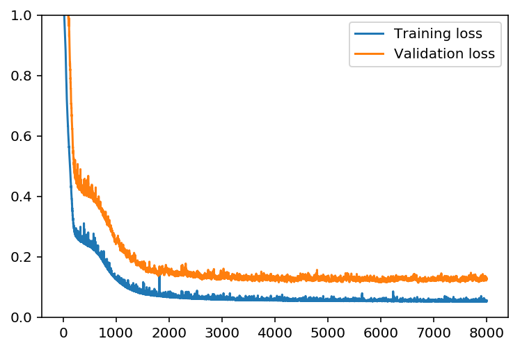
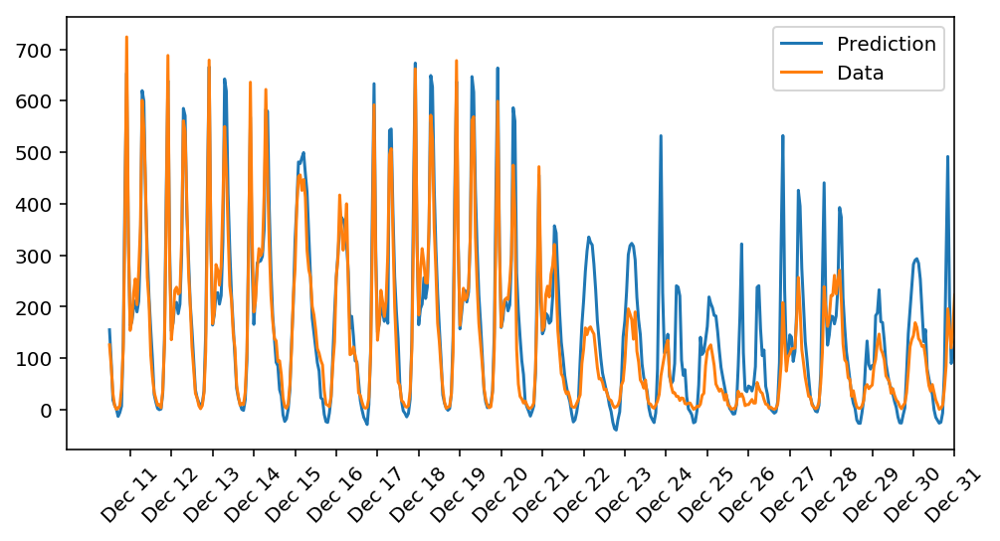

# bike-sharing  

**Bike-Sharing Prediction using Feedforward Neural Networks (FNNs)**  

**Summary**  
Implemented MLP, SGD and backpropagation using Numpy to predict daily ridership, validation loss (MSE) = 0.14  
  
Please see detail in python notebook (.ipynb)  
  
**Sample Results:**  
  
  
